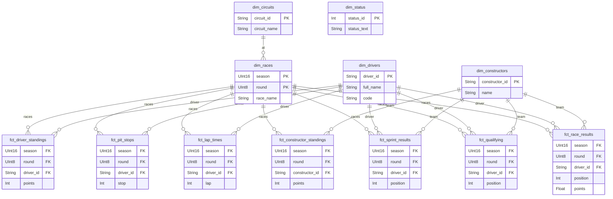

# 🏎️ F1 Data Pipeline

[](https://www.python.org/downloads/)
[](https://opensource.org/licenses/MIT)

A **production-grade, open-source data platform** that ingests Formula 1
historical data from the Ergast API (via Jolpica) and serves it for analytical
use cases. Built with industry best practices, this project demonstrates modern
data engineering patterns suitable for FAANG-level system design interviews and
real-world production deployments.

## 📋 Table of Contents

- [Features](#-features)
- [Architecture](#%EF%B8%8F-architecture)
- [Technology Stack](#%EF%B8%8F-technology-stack)
- [Prerequisites](#-prerequisites)
- [Quick Start](#-quick-start)
- [Project Structure](#-project-structure)
- [Usage](#-usage)
- [Development](#-development)
- [Testing](#-testing)
- [Deployment](#-deployment)
- [Monitoring](#-monitoring)
- [Troubleshooting](#-troubleshooting)
- [Contributing](#-contributing)
- [License](#-license)

---

## ✨ Features

### Data Engineering Capabilities

- **Medallion Architecture**: strict Bronze → Silver → Gold separation
- **Idempotent Processing**: Safe reruns with automatic duplicate detection
- **Smart Refresh Strategy**: Force refresh for current season, skip
  historical data
- **Automatic Pagination**: Handles large datasets with configurable page sizes
- **Retry Logic**: Exponential backoff with configurable attempts
- **Rate Limiting**: Respects API quotas (4 req/sec, 200 req/min)

### Production Features

- **Connection Pooling**: Optimized S3 client with 50 max connections
- **Comprehensive Logging**: Structured logs with correlation IDs
- **Error Recovery**: Graceful failure handling with detailed error messages
- **Statistics Tracking**: Real-time metrics on files written/skipped/errors
- **Configuration Validation**: Environment-based config with validation
- **Type Safety**: Full type hints for IDE support and safety

### Data Coverage

- **75+ Years**: Historical data from 1950 to present
- **13 Endpoints**: Comprehensive coverage of F1 data
  - Reference: seasons, circuits, status
  - Season-level: constructors, drivers, races
  - Race-level: results, qualifying, sprint, pitstops, laps
  - Standings: driver standings, constructor standings
- **15,000+ Races**: Complete historical race results
- **500K+ Results**: Individual race results with detailed telemetry

---

## 🏗️ Architecture

### High-Level Design (Current & Planned)

<!-- markdownlint-disable MD013 -->

```text
┌─────────────────┐
│  Ergast API     │ (Jolpica Mirror)
│  13 Endpoints   │
└────────┬────────┘
         │
         ▼
┌─────────────────────────────────────────────────────┐
│              Apache Airflow 3.x                     │
│  ┌──────────────────────────────────────────────┐   │
│  │  DAG: f1_production_pipeline (Yearly)        │   │
│  │                                              │   │
│  │  Task 1: Extract (API → Bronze) ✅           │   │
│  │  Task 2: Transform (Bronze → Silver) ✅      │   │
│  │  Group 3: dbt Gold Layer (via Cosmos) ✅     │   │
│  └──────────────────────────────────────────────┘   │
└─────────────────────────────────────────────────────┘
         │
         ▼
┌─────────────────────────────────────────────────────┐
│              MinIO (S3-Compatible)                  │
│  ┌──────────┐  ┌──────────┐                         │
│  │  Bronze  │  │  Silver  │                         │
│  │  Raw     │→ │ Parquet  │  (Polars/Pydantic)      │
│  │  JSON    │  │ Typed    │                         │
│  └──────────┘  └──────────┘                         │
└─────────────────────────────────────────────────────┘
         │
         ▼
┌─────────────────────────────────────────────────────┐
│              ClickHouse OLAP                        │
│  ┌──────────────┐  ┌──────────────┐                 │
│  │ Staging      │  │ Gold Models  │                 │
│  │ (S3 Engine)  │→ │ Facts & Dims │  (via dbt)      │
│  └──────────────┘  └──────────────┘                 │
└─────────────────────────────────────────────────────┘
```

### Medallion Architecture

| Layer      | Format     | Purpose                                       | Status     |
| ---------- | ---------- | --------------------------------------------- | ---------- |
| **Bronze** | JSON       | Raw immutable source data                     | ✅ Active  |
| **Silver** | Parquet    | Cleaned, typed, validated (via Polars)        | ✅ Active  |
| **Gold**   | ClickHouse | Analytics-ready facts & dims (via dbt)        | ✅ Active  |

### Gold Layer Star Schema

<!-- markdownlint-disable MD013 -->



<!-- markdownlint-enable MD013 -->

---

## 🛠️ Technology Stack

<!-- markdownlint-disable MD013 -->
| Component             | Technology              | Purpose                               |
| --------------------- | ----------------------- | ------------------------------------- |
| **Orchestration**     | Apache Airflow 3.1.8    | Modern AI-augmented orchestration     |
| **dbt Management**    | Astronomer Cosmos 1.13  | Granular dbt observability            |
| **Storage**           | MinIO (S3-compatible)   | Object storage (Bronze/Silver layers) |
| **Transformation**    | Python 3.12 + Polars    | High-performance data processing      |
| **Data Warehouse**    | ClickHouse 24.3         | High-performance OLAP database        |
| **Schema Validation** | Pydantic 2.x            | Type-safe data validation             |
| **HTTP Client**       | Requests + Tenacity     | API calls with retry logic            |
| **Rate Limiting**     | requests-ratelimiter    | Client-side API throttling            |
| **Metadata Store**    | PostgreSQL 13           | Airflow backend database              |
| **Container Runtime** | Docker + Docker Compose | Local development environment         |

<!-- markdownlint-enable MD013 -->

---

## 📦 Prerequisites

### Required Software

- **Docker Desktop**: 4.20+ ([Download](https://www.docker.com/products/docker-desktop))
- **Docker Compose**: 2.20+ (included with Docker Desktop)
- **Python**: 3.12+ ([Download](https://www.python.org/downloads/))
- **Git**: Latest version

### System Requirements

- **RAM**: Minimum 8GB (16GB recommended)
- **Disk**: 20GB free space
- **CPU**: 2+ cores
- **OS**: macOS, Linux, or Windows with WSL2

---

## 🚀 Quick Start

### 1. Clone Repository

```bash
git clone https://github.com/Naveenksaragadam/f1_pipeline.git
cd f1_pipeline
```

### 2. Set Up Environment

This project uses `.env` for configuration and
[uv](https://github.com/astral-sh/uv) and `make` for streamlined local
development.

```bash
# 1. Copy the example environment file
cp .env.example .env

# 2. Install uv package manager (if not already installed)
curl -LsSf https://astral.sh/uv/install.sh | sh

# 3. Install dependencies and set up the local virtual environment
make install-dev

# 4. Activate the virtual environment
source .venv/bin/activate
```

_(Note: Review `.env.example` to see the full list of configurable limits and
endpoints. The defaults work securely out of the box for local development)._

### 3. Start Services

Use the provided `Makefile` to easily manage the Docker infrastructure.

```bash
# Start all services (Airflow, MinIO, ClickHouse, Postgres)
make docker-up

# Verify services are healthy
docker-compose ps
```

**Expected output:**

```text
NAME                STATUS              PORTS
f1_airflow_init     exited (0)
f1_airflow_scheduler running
f1_airflow_webserver running            0.0.0.0:8080->8080/tcp
f1_clickhouse       running            0.0.0.0:8123->8123/tcp, 0.0.0.0:9009->9000/tcp
f1_minio            running            0.0.0.0:9000-9001->9000-9001/tcp
f1_postgres         running            5432/tcp
```

### 4. Access Web Interfaces

| Service           | URL                     | Credentials                 |
| ----------------- | ----------------------- | --------------------------- |
| **Airflow UI**    | <http://localhost:8080> | `airflow` / `airflow`       |
| **MinIO Console** | <http://localhost:9001> | `minioadmin` / `minioadmin` |
| **ClickHouse**    | <http://localhost:8123> | `default` / (no password)   |

### 5. Run Your First Extraction

#### Option A: Via Airflow UI

1. Navigate to <http://localhost:8080>
2. Enable the `f1_production_pipeline` DAG
3. Click **Trigger DAG** (manually trigger for 2024 season)

#### Option B: Via Command Line

```bash
# Trigger DAG manually
docker-compose exec airflow-scheduler airflow dags trigger f1_production_pipeline

# Or run backfill for historical seasons
docker-compose exec airflow-scheduler \
  python -m f1_pipeline.backfill.backfill --start 2020 --end 2023
```

### 6. Verify Data

```bash
# List Bronze layer files
docker-compose exec airflow-scheduler python -c "
from f1_pipeline.minio.object_store import F1ObjectStore
from f1_pipeline.config import (
    MINIO_BUCKET_BRONZE,
    MINIO_ENDPOINT,
    MINIO_ACCESS_KEY,
    MINIO_SECRET_KEY,
)
store = F1ObjectStore(
    MINIO_BUCKET_BRONZE, MINIO_ENDPOINT, MINIO_ACCESS_KEY, MINIO_SECRET_KEY
)
objects = store.list_objects('ergast/endpoint=races')
print(f'Found {len(objects)} files')
print(objects[:5])
"
```

---

## 📁 Project Structure

```text
f1_pipeline/
├── dags/
│   └── ingestion_dag.py          # Airflow DAG (Bronze → Silver → Gold)
│
├── src/
│   └── f1_pipeline/
│       ├── ingestion/
│       │   ├── __init__.py       # Module exports
│       │   ├── ingestor.py       # Core extraction engine
│       │   └── http_client.py    # HTTP session with retries
│       │
│       ├── backfill/
│       │   └── backfill.py       # CLI backfill script
│       │
│       ├── config.py             # Configuration & validation
│       ├── minio/
│       │   ├── object_store.py   # S3/MinIO client wrapper
│       │   └── init_storage.py   # Bucket initialization
│       │
│       └── transform/
│           ├── base.py           # Base transformer class
│           ├── factory.py        # Transformer factory
│           ├── run.py            # Transformation runner
│           └── schemas.py        # Pydantic models (13 endpoints)
│
├── f1_dbt/                        # dbt project — Gold Layer
│   ├── dbt_project.yml           # dbt configuration
│   ├── profiles.yml              # ClickHouse connection (dev/ci/prod)
│   ├── macros/
│   │   └── read_silver_parquet.sql  # S3 reader with partition extraction
│   ├── models/
│   │   ├── staging/              # Views on Silver Parquet (S3-backed)
│   │   │   ├── stg_results.sql   # 11 staging models with season/round
│   │   │   ├── _sources.yml      #   extraction from S3 paths
│   │   │   └── ...
│   │   └── gold/
│   │       ├── dimensions/       # 5 dims (drivers, constructors, circuits,
│   │       │   └── ...           #         races, status)
│   │       ├── facts/            # 7 facts (results, qualifying, pit stops,
│   │       │   └── ...           #          laps, sprints, standings ×2)
│   │       └── _schema.yml       # 35 data quality tests
│   └── snapshots/
│       ├── snp_drivers.sql       # SCD Type 2 for drivers
│       └── snp_constructors.sql  # SCD Type 2 for constructors
│
├── tests/
│   └── unit/
│       ├── test_ingestor.py      # Ingestion unit tests
│       ├── test_object_store.py  # Storage tests
│       ├── test_transform.py     # Transformation tests
│       ├── test_config.py        # Config tests
│       └── conftest.py           # Pytest fixtures
│
├── config/
│   ├── clickhouse/
│   │   ├── users.xml             # ClickHouse user config
│   │   └── init.sql              # Database initialization
│   └── airflow/
│       └── (future DAG configs)
│
├── docker-compose.yaml           # Service definitions
├── Dockerfile                    # Airflow image build
├── pyproject.toml                # Python project config (uv)
├── requirements.txt              # Locked dependencies
├── .env.example                  # Example environment vars
├── Makefile                      # Development commands
└── README.md                     # This file
```

---

## 💻 Usage

### Manual Backfill

**Backfill specific seasons:**

```bash
python -m f1_pipeline.backfill.backfill \
  --start 2015 \
  --end 2023 \
  --batch-id "historical_load_v1"
```

**Backfill with error handling:**

```bash
# Skip failed seasons and continue
python -m f1_pipeline.backfill.backfill --start 1950 --end 2023

# Stop on first error
python -m f1_pipeline.backfill.backfill --start 1950 --end 2023 --no-skip-on-error
```

### Programmatic Usage

```python
from f1_pipeline.ingestion import F1DataIngestor
from datetime import datetime

# Initialize ingestor
ingestor = F1DataIngestor(validate_connection=True)

# Extract single season
summary = ingestor.run_full_extraction(
    season=2024,
    batch_id=datetime.now().strftime("%Y%m%d_%H%M%S"),
    force_refresh=True  # Use True for current season
)

print(f"Extraction completed: {summary['status']}")
print(f"Files written: {summary['files_written']}")
print(f"API calls: {summary['api_calls_made']}")
```

### Airflow DAG Customization

**Modify schedule in `dags/ingestion_dag.py`:**

```python
with DAG(
    dag_id="f1_production_pipeline",
    schedule="@yearly",           # Change to "@daily" for incremental
    start_date=pendulum.datetime(2024, 1, 1, tz="UTC"),
    catchup=True,                 # Set False to skip historical runs
    ...
) as dag:
    ...
```

---

## 🔧 Development

### Development Workflow

```bash
# Format code
make format

# Run linters + type check
make check

# Run tests
make test

# Run tests with coverage report
make test-cov
```

### Docker Management

```bash
# Start all services (Airflow, MinIO, ClickHouse, Postgres)
make docker-up

# Start only data infrastructure (MinIO, ClickHouse, Postgres) for local dev
make docker-infra

# Stop all services
make docker-down

# Tail logs for all containers
make docker-logs

# Open interactive shell in ClickHouse
make docker-shell-clickhouse

# Clean up all containers and volumes (Warning: Data Loss)
make docker-nuke
```

### Adding New Endpoints

1. **Update `config.py`** - Add endpoint configuration:

```python
ENDPOINT_CONFIG = {
    "your_endpoint": {
        "group": "race",  # or "season" or "reference"
        "url_pattern": "{season}/{round}/your_endpoint.json",
        "has_season": True,
        "has_round": True,
        "pagination": True,
    },
}
```

1. **Update `ingestor.py`** - Add to extraction flow:

```python
for endpoint in ["results", "qualifying", "your_endpoint"]:
    self.ingest_endpoint(endpoint, batch_id, season=season, round_num=round_num)
```

1. **Update `transform/schemas.py`** — Create a Pydantic schema

2. **Register in `transform/factory.py`** — Add to `TRANSFORM_FACTORY`

3. **Add tests** in `tests/unit/test_ingestor.py` and `tests/unit/test_transform.py`

---

## 🧪 Testing

### Run Test Suite

```bash
# All tests
pytest tests/ -v

# Unit tests only
pytest tests/ -v -m "not integration"

# Integration tests (requires running services)
make docker-up
pytest tests/ -v -m integration

# Coverage report
pytest tests/ --cov=src/f1_pipeline --cov-report=html
open htmlcov/index.html
```

### Test Categories

| Marker                     | Purpose            | Requirements    |
| -------------------------- | ------------------ | --------------- |
| (default)                  | Unit tests         | None            |
| `@pytest.mark.integration` | Integration tests  | Docker services |
| `@pytest.mark.slow`        | Long-running tests | None            |

---

## 🚢 Deployment

### Production Deployment

1. **Update environment variables:**

```bash
# Use production MinIO endpoint
MINIO_ENDPOINT=https://minio.prod.example.com

# Use production ClickHouse
CLICKHOUSE_HOST=clickhouse.prod.example.com
CLICKHOUSE_PASSWORD=<secure_password>
```

1. **Build production image:**

```bash
docker build -t f1-pipeline:v1.0.0 .
```

1. **Deploy with docker-compose:**

```bash
docker-compose -f docker-compose.prod.yaml up -d
```

### Kubernetes Deployment (Future)

```bash
# Apply manifests
kubectl apply -f k8s/namespace.yaml
kubectl apply -f k8s/secrets.yaml
kubectl apply -f k8s/deployments/
kubectl apply -f k8s/services/
```

---

## 📊 Monitoring

### Key Metrics to Track

| Metric                   | Source      | Alert Threshold |
| ------------------------ | ----------- | --------------- |
| DAG Success Rate         | Airflow     | < 95%           |
| Task Duration            | Airflow     | > 2x baseline   |
| API Calls Remaining      | Application | < 50 calls/min  |
| Storage Usage            | MinIO       | > 80% capacity  |
| ClickHouse Query Latency | ClickHouse  | p95 > 1s        |

### Log Locations

```bash
# Airflow logs
docker-compose logs -f airflow-scheduler
docker-compose logs -f airflow-webserver

# Application logs (in container)
docker-compose exec airflow-scheduler tail -f /opt/airflow/logs/dag_id=f1_production_pipeline/...

# MinIO logs
docker-compose logs -f minio

# ClickHouse logs
docker-compose exec clickhouse cat /var/log/clickhouse-server/clickhouse-server.log
```

---

## 🐛 Troubleshooting

### Common Issues

#### 1. MinIO 403 Forbidden Error

```bash
# Error: An error occurred (403) when calling the HeadBucket operation: Forbidden

# Solution: Verify credentials and restart MinIO
docker-compose restart minio

# Or recreate with correct credentials (WARNING: Data Loss)
make docker-nuke
make docker-up
```

#### 2. Airflow Webserver Not Starting

```bash
# Check initialization status
docker-compose logs airflow-init

# Recreate database (WARNING: Data Loss)
make docker-nuke
make docker-up
```

#### 3. API Rate Limit Errors

```bash
# Symptoms: 429 Too Many Requests

# Solution: Adjust rate limits in .env
API_RATE_LIMIT_PER_SEC=2  # Reduce from 4
API_RATE_LIMIT_PER_MIN=100  # Reduce from 200
```

#### 4. Out of Memory Errors

```bash
# Increase Docker memory allocation
# Docker Desktop → Settings → Resources → Memory → 8GB+

# Or reduce parallelism
max_active_runs=1  # In DAG config
```

### Debug Mode

```bash
# Enable debug logging
export AIRFLOW__LOGGING__LOGGING_LEVEL=DEBUG

# Run extraction with verbose output
python -m f1_pipeline.backfill.backfill \
  --start 2024 --end 2024 -v
```

---

## 🤝 Contributing

We welcome contributions! Please see our
[Contributing Guide](CONTRIBUTING.md) for details.

### Development Process

1. **Fork** the repository
2. **Create** a feature branch (`git checkout -b feature/amazing-feature`)
3. **Make** your changes
4. **Run** tests (`make test`)
5. **Commit** with conventional commits (`git commit -m 'feat: add amazing feature'`)
6. **Push** to your fork (`git push origin feature/amazing-feature`)
7. **Open** a Pull Request

### Code Standards

- **PEP 8** compliant code
- **Type hints** on all functions
- **Docstrings** for public APIs
- **Tests** for new features
- **No breaking changes** without discussion

---

## 📄 License

This project is licensed under the MIT License - see the [LICENSE](LICENSE) file
for details.

---

## 🙏 Acknowledgments

- **Ergast API** - Historical F1 data source (RIP Chris Nevers)
- **Jolpica** - Mirror maintaining Ergast API access
- **Apache Airflow** - Workflow orchestration
- **MinIO** - S3-compatible object storage
- **ClickHouse** - High-performance analytics engine

---

## 📞 Support

- **Issues**: [GitHub Issues](https://github.com/Naveenksaragadam/f1_pipeline/issues)
- **Discussions**: [GitHub Discussions](https://github.com/Naveenksaragadam/f1_pipeline/discussions)
- **Email**: <naveen.saragdam.de@gmail.com>

---

## 🗺️ Roadmap

### Phase 1: Core Pipeline ✅

- [x] Bronze layer ingestion
- [x] 13 endpoint coverage
- [x] Idempotent processing
- [x] Airflow orchestration

### Phase 2: Silver Layer ✅

- [x] Parquet transformation (Polars)
- [x] Schema validation (Pydantic)
- [x] Auto-explosion of nested lists
- [x] Recursive struct flattening
- [x] Wired into Airflow DAG (`transform_season_data` task)
- [x] Global endpoint routing (seasons/status without season partition)
- [x] Per-file error isolation

### Phase 3: Gold Layer (dbt Star Schema) ✅

- [x] Astronomer Cosmos integration (28 Airflow tasks auto-generated)
- [x] dbt staging models — 11 views on Silver Parquet via S3 engine
- [x] Partition-aware `season`/`round` extraction from Hive-style S3 paths
- [x] 5 dimension models with `ROW_NUMBER` deduplication
- [x] 7 fact models with temporal context (`season`, `round` FK)
- [x] SCD Type 2 snapshots for drivers & constructors
- [x] 35 data quality tests (`not_null`, `unique`) — all passing
- [x] ClickHouse-specific optimizations (`allow_nullable_key`, schema inference)

### Phase 4: Analytics (Future)

- [ ] Apache Superset dashboards
- [ ] Pre-built analytics queries
- [ ] ML feature engineering
- [ ] Real-time lap prediction

---

Built with ❤️ for the F1 community

[⭐ Star this repo](https://github.com/Naveenksaragadam/f1_pipeline) |
[🐛 Report Bug](https://github.com/Naveenksaragadam/f1_pipeline/issues) |
[✨ Request Feature](https://github.com/Naveenksaragadam/f1_pipeline/issues)
